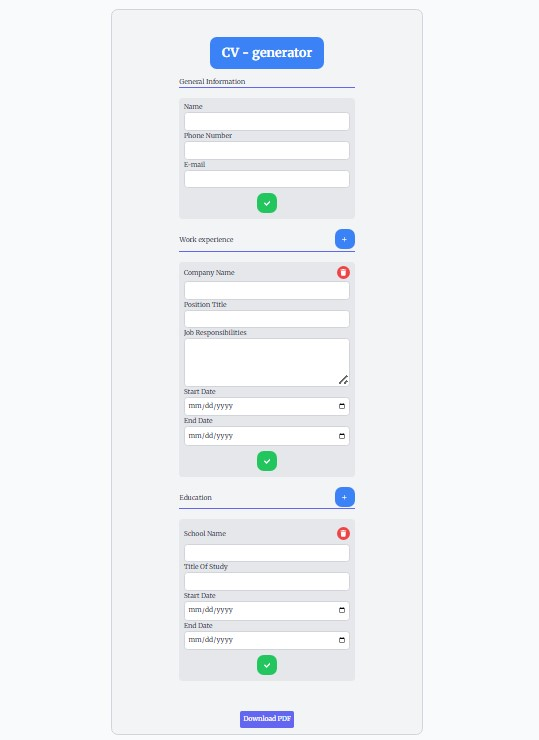
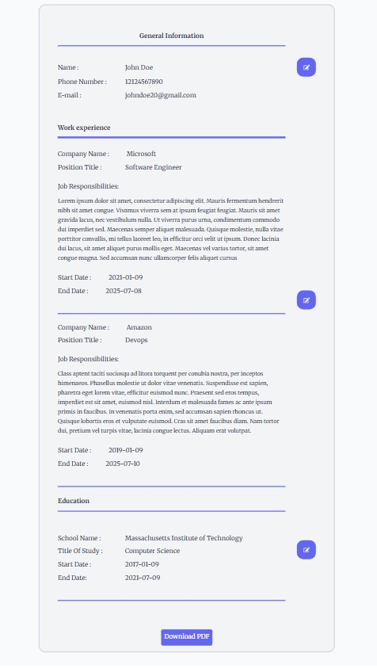

# 📄 CV Application Generator

A responsive React application that allows users to input their general, educational, and work experience information and generate a well-formatted CV in PDF format using `jsPDF` and `html2canvas`.

---

## ✨ Features

- 📝 Add/Edit/Delete sections (General Info, Education, Company)
- 🔍 Live preview of the CV layout
- 🎨 Responsive design with Tailwind CSS
- 📄 Export CV as PDF (buttons like Edit/Delete excluded)
- ♻️ Reusable React components & icons

---

## ✨ Check it out Live
Click here ---> [link](https://cv-generator-pdf-downloader.netlify.app/)

---

## 🖼️ Screenshots

| Form Input | CV Preview |
|------------|-------------|
|  | 

---

## 📎 Sample PDF

Want to see the output? [Download Sample CV](./assets/John_Doe_cv.pdf)

---

### 🧠 Smart State Management

This app isn’t just pretty — it's built with solid React state handling behind the scenes. You can freely add as many education or experience sections as you want without breaking a sweat. The dynamic forms, controlled inputs, and clean UI transitions all work together to make the experience smooth and intuitive.

---

## 🚀 Technologies Used

- ⚛️ React
- 🌬️ Tailwind CSS
- 🖨️ jsPDF
- 🖼️ html2canvas
- 🎯 React Icons

---

## 📦 Installation

```bash
git clone https://github.com/your-username/cv-application-generator.git
cd cv-application-generator
npm install
npm start
